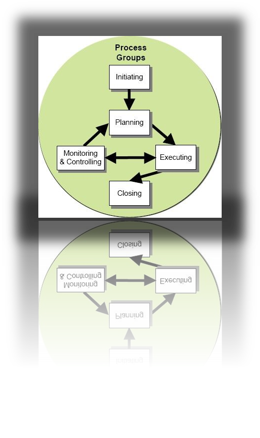
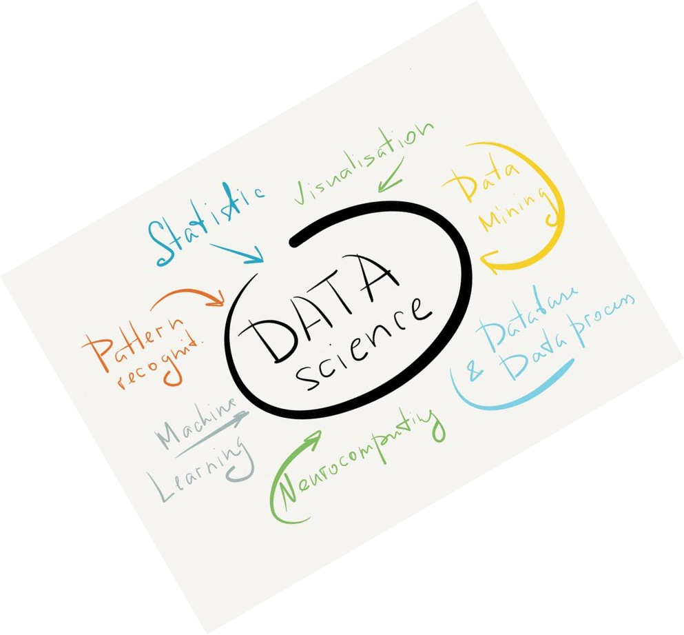

DATA-607 Project 3
========================================================
title: Team 3
author: Duubar Villalabos, Tom Detzel, Ambra Barboni-Alexander, Kyle Glide, Raghunathan Ramnath, Dilip Ganesan, Pavan Akula
date: 
autosize: true

Overview
========================================================
class: small-code

***
As part of the course curriculum, this project exposes entire team to broad array of skills including communications, team building, goal setting, task identification and delegation. In a nutshell project can be summarized as building project management skills with virtual teams.

Project - Management Skills
========================================================
- Virtual Teams versus Face-to-Face Teams.

- Working with geographically distributed professionals.

- Collaborate on a variety of workplace tasks.

- Effectiveness of information exchange.

- Creating trust and Keeping motivated.

Big Challenges
========================================================
- Trust was observed as a critical factor for effective communication in the team.

- Having a clear vision for the team.

- Creating team spirit and team goals.

- Prioritizing the tasks

Communications Management
========================================================

***
- Face-to-face communication was beneficial.

- Logging what, who and how and frequency.

- Logging origination, nuances.

- Recognizing team members accomplishments.

Communication Tools
========================================================
- Slack and What's App: Social media tool, to communicate with team members.

- Join Me: For voice calls and idea presentation

- Github: Code sharing

- R Studio: Primary development tool

- MySQL: RDBMS used to store data in normalized format

- Google Spreadsheets: Monitoring and managing tasks

Tasks and output
========================================================

***
The output we got from each other remotely is comparable to what we would have got working locally.

- Our team was smart.

- Could think for themselves.

- Innovative and well educated in their tasks.

Team
========================================================
- Duubar Villalabos: Team leader, coordinating entire team from task identification to delegation.
- Tom Detzel: Dataset Analyst, major in role in identifying the dataset. Web Scrapping and harvesting raw data.
- Pavan Akula: Data modeler, MySQL database design.
- Kyle Glide: Data wrangler, Tidying and Formatting data to store data into MySQL DB.
- Ambra Barboni-Alexander: Data wrangler, Tidying and Formatting data to store data into MySQL DB.
- Raghunathan Ramnath: Data wrangler, Tidying and Formatting data to store data into MySQL DB.
- Dilip Ganesan: Data wrangler, Pattern recognition and producing raw dataset.
